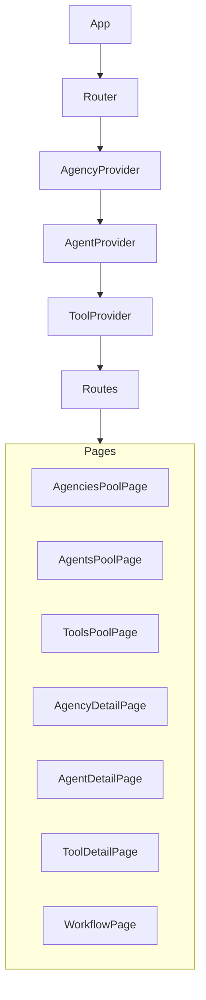

# Frontend Architecture: Agencies, Agents, and Tools Pools

This document outlines the revised React + Vite frontend architecture modeling three independent pools—Agencies, Agents, Tools—with many-to-many relationships. It includes component/provider hierarchy, route definitions, state management, API layer outlines, backend endpoints, and updated file structure.

## 1. Component & Provider Tree



## 2. Routes

```tsx
<Routes>
  <Route path="/agencies" element={<AgenciesPoolPage />} />
  <Route path="/agents"   element={<AgentsPoolPage />} />
  <Route path="/tools"    element={<ToolsPoolPage />} />

  <Route path="/agencies/:agencyId" element={<AgencyDetailPage />} />
  <Route path="/agents/:agentId"     element={<AgentDetailPage />} />
  <Route path="/tools/:toolId"       element={<ToolDetailPage />} />
  
  <Route path="/workflow/:agencyId" element={<WorkflowPage />} />
  <Route index element={<Navigate to="/agencies" replace />} />
</Routes>
```

## 3. State Management & API Services

- **Client State:** Redux Toolkit with RTK Query  
- **Slices / Services:**  
  - `agencyApi` (list, get, create, update, delete)  
  - `agentApi`  (list, get, create, update, delete)  
  - `toolApi`   (list, get, create, update, delete)  
- **Association Endpoints:**  
  - `POST   /agencies/{agencyId}/agents/{agentId}`  
  - `DELETE /agencies/{agencyId}/agents/{agentId}`  
  - `POST   /agents/{agentId}/tools/{toolId}`  
  - `DELETE /agents/{agentId}/tools/{toolId}`  

## 4. Backend Endpoints

```
GET    /agencies
POST   /agencies
GET    /agencies/{agencyId}
PUT    /agencies/{agencyId}
DELETE /agencies/{agencyId}

GET    /agents
POST   /agents
GET    /agents/{agentId}
PUT    /agents/{agentId}
DELETE /agents/{agentId}

GET    /tools
POST   /tools
GET    /tools/{toolId}
PUT    /tools/{toolId}
DELETE /tools/{toolId}

POST   /agencies/{agencyId}/agents/{agentId}
DELETE /agencies/{agencyId}/agents/{agencyId}
POST   /agents/{agentId}/tools/{toolId}
DELETE /agents/{agentId}/tools/{toolId}
```

## 5. Updated File Structure

```
src/
├── api/
│   ├── agencyApi.ts
│   ├── agentApi.ts
│   └── toolApi.ts
├── app/
│   ├── providers/
│   │   ├── AgencyProvider.tsx
│   │   ├── AgentProvider.tsx
│   │   └── ToolProvider.tsx
│   ├── pages/
│   │   ├── AgenciesPoolPage.tsx
│   │   ├── AgentsPoolPage.tsx
│   │   ├── ToolsPoolPage.tsx
│   │   ├── AgencyDetailPage.tsx
│   │   ├── AgentDetailPage.tsx
│   │   ├── ToolDetailPage.tsx
│   │   └── WorkflowPage.tsx
│   └── components/
│       ├── PoolList.tsx
│       ├── AssignmentList.tsx
│       └── NodeGraph.tsx
├── store/
│   ├── index.ts
│   ├── agencyApi.ts
│   ├── agentApi.ts
│   └── toolApi.ts
├── routes.tsx
├── App.tsx
└── main.tsx